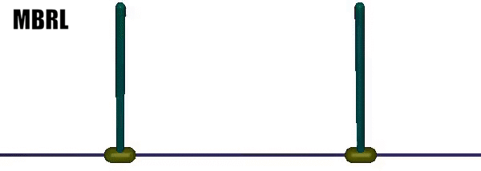
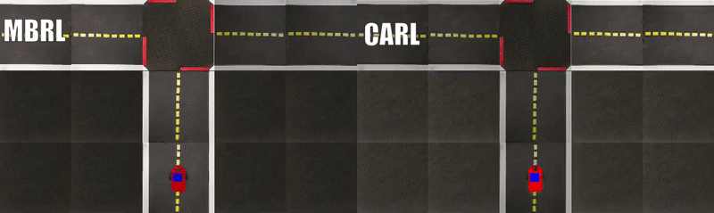

# Cautious Adaptation For Reinforcement Learning in Safety-Critical Settings (CARL).


This is the repository for our work, [Cautious Adaptation for RL in Safety-Critical Settings (CARL)](https://arxiv.org/abs/2008.06622).


Our code is based off of the repository at [https://github.com/quanvuong/handful-of-trials-pytorch](https://github.com/quanvuong/handful-of-trials-pytorch), 
which is a Pytorch version of the original PETS paper repository located here: [PETS-Tensorflow](https://github.com/kchua/handful-of-trials).

## Installation
Clone this repository with `git clone --recursive https://github.com/jesbu1/carl.git`.
This recursively clone the two submodules required, `gym-duckietown` (code for the modified [Duckietown](https://github.com/jesbu1/gym-duckietown.git) driving environment) and `learning_to_adapt` (code containing the [Half-Cheetah Disabled Joint environment](https://github.com/jesbu1/learning_to_adapt) from [GrBAL](https://arxiv.org/abs/1803.11347) .

In order to experiment on MuJoco environments, you must have MuJoco 200 installed with an appropriate MuJuco license linked.
See here to download and setup MuJoco 200: [mujoco](https://www.roboti.us/index.html). On Ubuntu, we had to install some extra packages first: `sudo apt install -y libosmesa6-dev libgl1-mesa-glx libglfw3 patchelf`.


To install the base packages required, simply `pip install -r requirements.txt` (Tested with Python 3.6). 
Then you must `pip install -e gym-duckietown` to install the modified Duckietown driving environment, and `pip install -e learning_to_adapt`
to install the disabled joint Half-Cheetah environment code originally from GrBAL.

## Running Experiments
For PDDM Baoding Hand manipulation experiments, see this repo [here](https://github.com/jesbu1/pddm).

Experiments for the other three environments can be run using:

```
python mbexp.py
    --env    ENV       (required) The name of the environment. Select from
                           [cartpole, halfcheetahdisabled, duckietown].
```

Results will be saved in `<logdir>/<date+time of experiment start>/`.
Trial data will be contained in `<logdir>/<date+time of experiment start>-tboard`, 
You can run `tensorboard --logdir <logdir>` to visualize the results

To run CARL with catastrophic state risk aversion, you don't need any extra flags.

To run CARL (Reward), you can run:
`python mbexp.py --env ENV --no_catastrophe_pred --percentile PERCENTILE --test_percentile TEST_PERCENTILE`
This turns off catastrophe prediction. We train with percentile (gamma) = 100 and test_percentile (gamma) = 50 for all environments.

To run MB + Finetune, you can run:
`python mbexp.py --env ENV --no_catastrophe_pred --test_percentile 100`

## Directory Structure
Configuration files are located in `config/`, modify these python files to change some environment/model/training parameters.

The ensemble model class is also located in `config/`.

`env/` contains gym environment files.

`MPC.py` contains training code and acting code for the MPC controller.

`optimizers.py` contains the optimizers (CEM) used for optimizing actions with MPC.

`MBExperiment.py` contains training, adaptation, and testing loop code.

`Agent.py` contains logic for interacting with the environment with model-based planning and collecting samples

## Notes
In order to run the Duckietown car-driving environment, you need to have either a real or virtual display.
This is an unfortunate restriction of the original environment. One option is to create a Docker container,
another is install xvfb and running `xvfb-run python mbexp.py ....`, however we have had limited luck in
getting this to work on displayless servers.

## Example Behaviors (Regular MBRL vs CARL)




## Cite our work
You can cite CARL with this example bibtex
```
@misc{zhang2020cautious,
    title={Cautious Adaptation For Reinforcement Learning in Safety-Critical Settings},
    author={Jesse Zhang and Brian Cheung and Chelsea Finn and Sergey Levine and Dinesh Jayaraman},
    year={2020},
    eprint={2008.06622},
    archivePrefix={arXiv},
    primaryClass={cs.LG}
}
```
